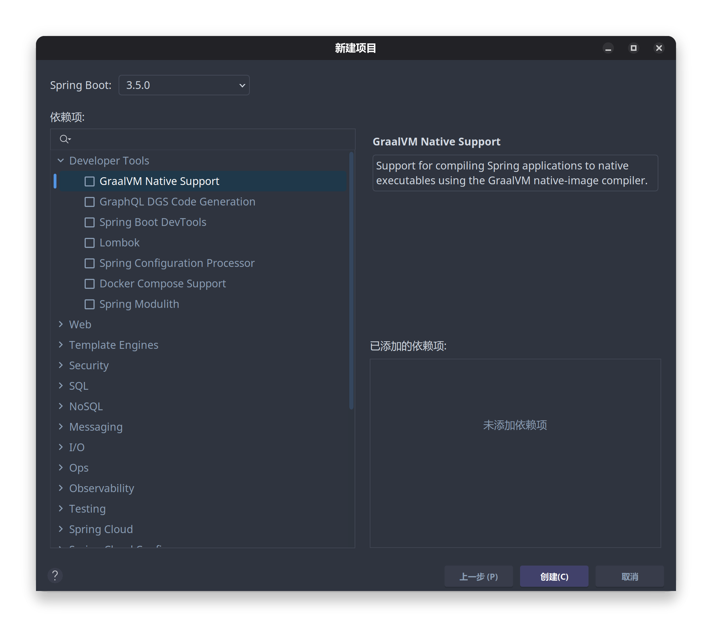

# SpringBoot 简介

## 项目创建

**这里使用IDEA创建的SpringBoot项目**

1. 打开IDEA，点击 `新建项目`

2. 在 `生成器` 中选择 `Spring Boot`

修改以下内容：

- `服务器 URL`: 保持默认 `start.spring.io` 即可
- `项目名称`：可以根据自己的需求修改
- `项目位置`：可以根据自己的需求修改
- `语言`：默认选择 `Java`
- `项目类型`：默认选择 `Maven`
- `包名`：默认选择 `com.example`
- `组名`: 可以根据自己的需求修改
- `工件`：可以根据自己的需求修改
    - **注意: `软件包名称` 不能修改，否则会导致项目无法启动**
- `JDK`：默认选择最新的版本`
- `打包方式`：默认选择 `Jar`

- 如果有版本控制，可以选择 `Git`

4. 点击 `下一步`，选择 `SpringBoot` 的版本和依赖

5. 点击 `创建`，等待项目创建完成

## 项目结构

- `.idea`：IDEA的项目配置文件，无需修改

- `.mvn`：Maven的项目配置文件
    - wrapper
        - maven-wrapper.properties：Maven的版本信息，**确保在不同的环境下，Maven的版本是一致的**

- `mvnw` / `mvnw.cmd`：Maven的可执行文件，用于在命令行中执行Maven命令

- `pom.xml`：Maven的项目配置文件，用于管理项目的依赖和插件

- `HELP.md`：SpringBoot的帮助文档，用于查看SpringBoot的相关信息

- `src`：项目的源代码目录
    - `main`：项目的主源代码目录
        - `java`：项目的Java源代码目录
        - `resources`：项目的资源文件目录
            - `application.properties`：项目的配置文件，用于配置项目的相关信息
    - `test`：项目的测试源代码目录
        - `java`：项目的Java测试源代码目录
        - `resources`：项目的资源文件目录

## 依赖管理

SpringBoot的依赖管理是通过Maven来管理的，但SpringBoot提供了 `spring-boot-starter-web` 来简化依赖管理，只需要在 `pom.xml` 中添加以下依赖即可

1. 打开 maven center 搜索 `spring-boot-starter-web`

2. 在 `Snippets` 选择 `Apche Maven`，点击 `Copy` 复制依赖到 `pom.xml` 中

3. 点击 `pom.xml` 中的 `Maven` 图标，点击 `Reload` 重新加载依赖

