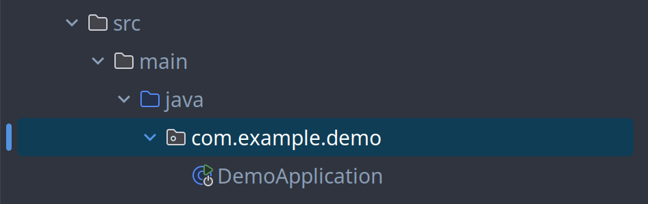
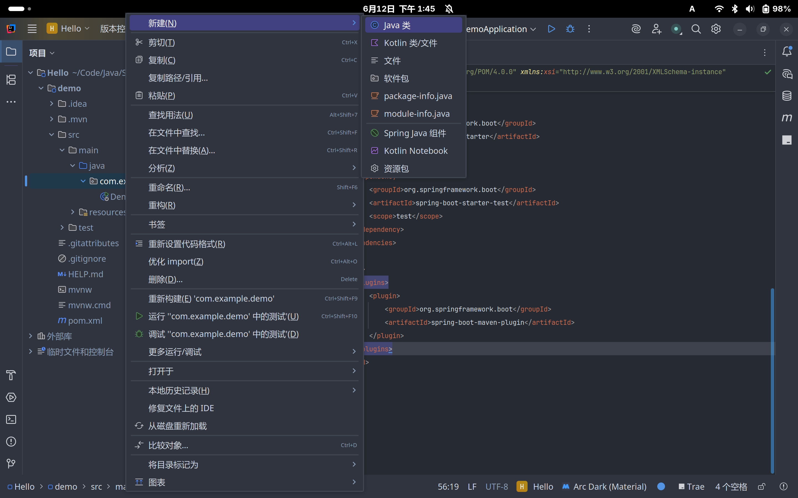
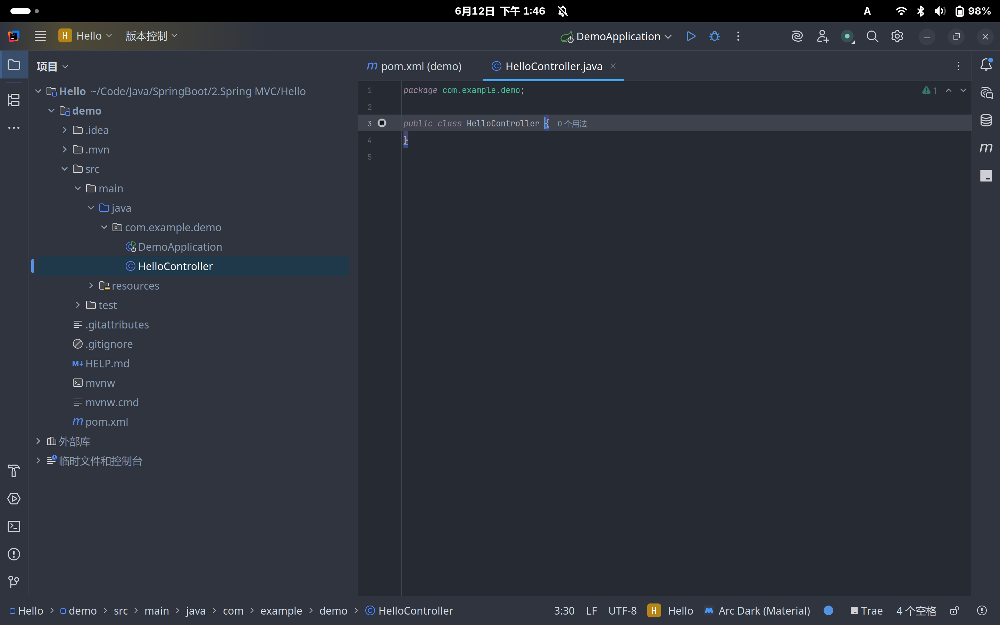
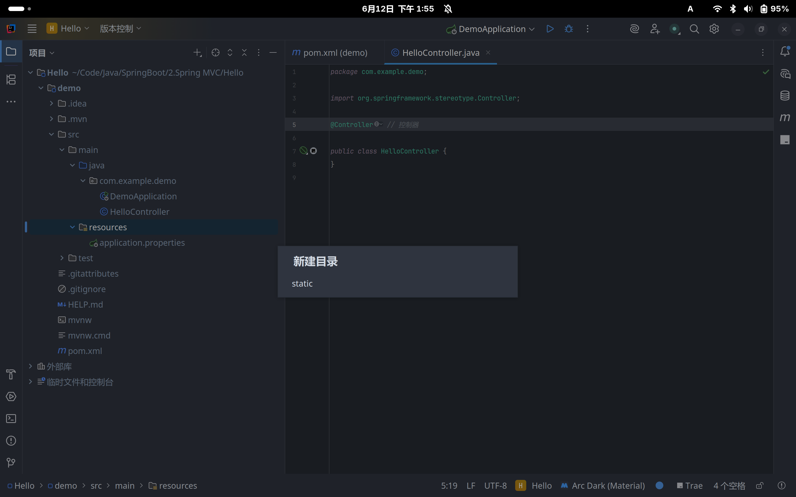
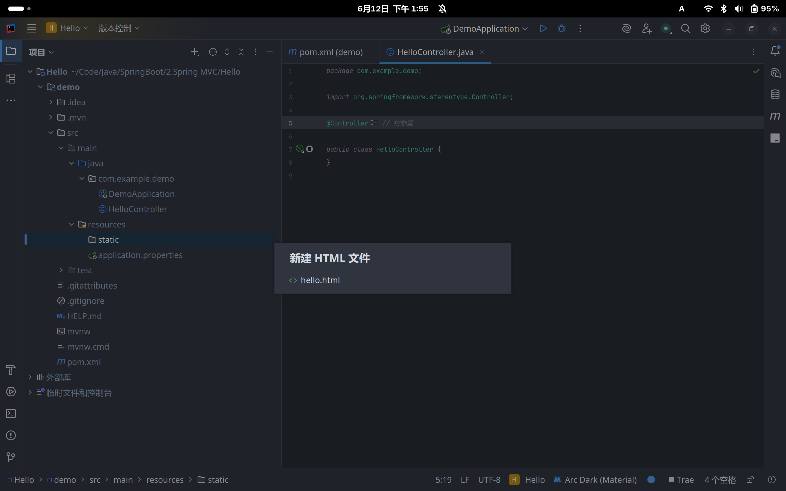
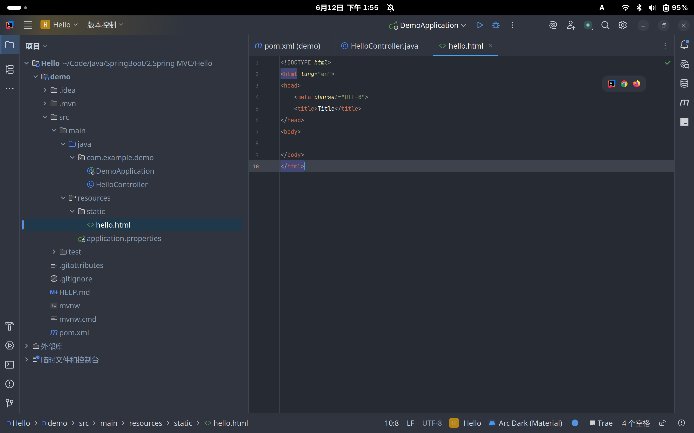
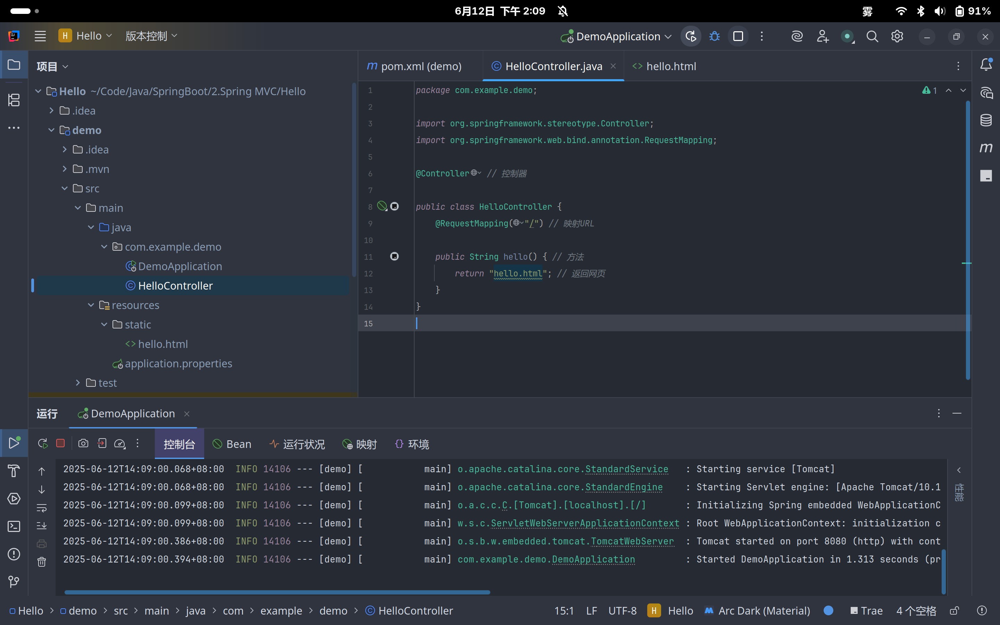
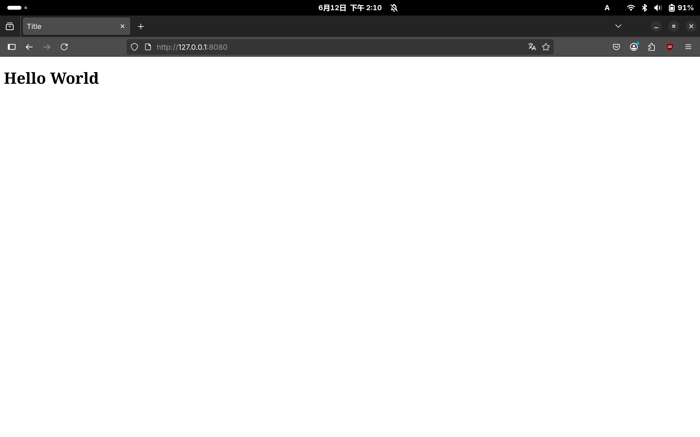

# 快速开始

## 简介

Spring MVC是Spring框架的一部分，用于构建Web应用程序。**它提供了一种基于MVC（Model-View-Controller）模式的方式来处理Web请求和响应**

- Model: 保存数据和业务逻辑
    - 例如: 数据库操作
- View: 展示数据
    - 例如: 用户界面
- Controller: 处理请求和响应
    - 例如: 路由、过滤器、拦截器

## 代码示例

### 创建类

在 `src/main/java/com.example.demo` 目录下创建一个 `HelloController` 类





### 创建控制器

在 `HelloController` 类名前添加 `@Controller` 注解，表明这是一个控制器

- `@Controller` 注解用于标识一个类为控制器，它将处理HTTP请求并返回视图

```java
// HelloController.java

package com.example.demo;

import org.springframework.stereotype.Controller; // 导入控制器注解

@Controller // 控制器

public class HelloController {
}
```

### 创建方法

在 `HelloController` 类中创建一个方法

```java
...
public class HelloController {
    public String hello() { // 方法
        return "hello.html"; // 返回网页
    }
}
```

但是，这样的方法是无法被访问的，因为它只是一个普通的方法，没有被映射到任何URL

### 映射URL

在 `HelloController` 类中创建一个方法，并添加 `@RequestMapping` 注解

```java
@RequestMapping(<路径>) // 映射URL
```

- `@RequestMapping` 注解用于将HTTP请求映射到特定的处理方法

```java
import org.springframework.web.bind.annotation.RequestMapping; // 导入请求映射注解

public class HelloController {
    @RequestMapping("/") // 映射URL

    public String hello() { // 方法
        return "hello.html"; // 返回网页
    }
}
```

### 添加资源

由于 `hello.html` 是一个静态资源，所以需要将其添加到 `src/main/resources/static` 目录下





### 输出 `Hello World!`
在 `hello.html` 中添加一个 `Hello World!` 文本

```html
<!DOCTYPE html>
<html lang="en">
<head>
    <meta charset="UTF-8">
    <title>Title</title>
</head>
<body>
    <h1>Hello World</h1>
</body>
</html>
```

### 运行

进入项目跟目录，运行以下命令

```bash
./mvnw -v spring-boot:run
```

或者在 IDEA 中点击运行按钮



### 访问

在浏览器中访问 `http://localhost:8080/`

