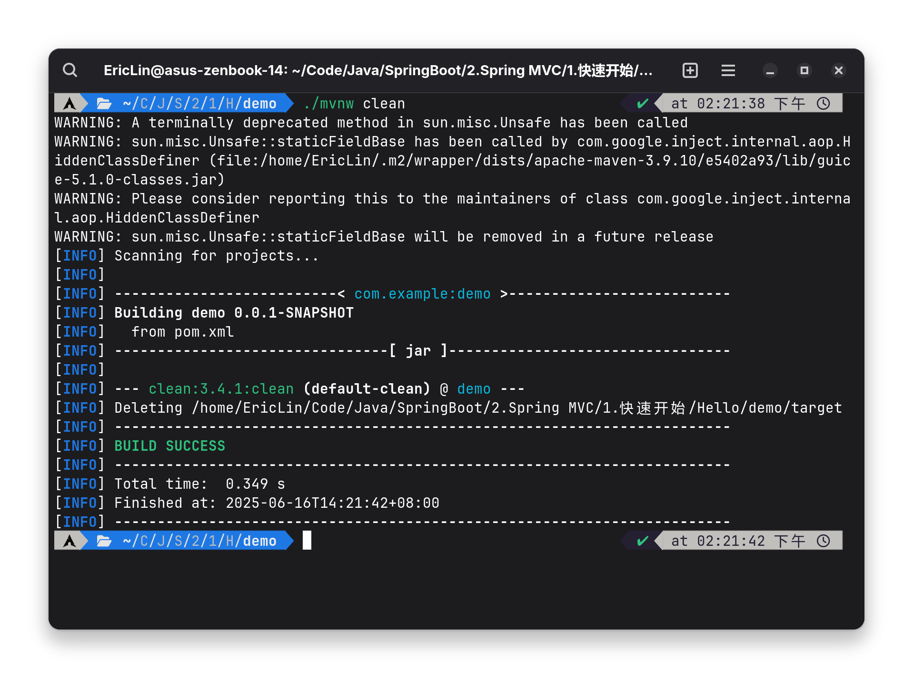
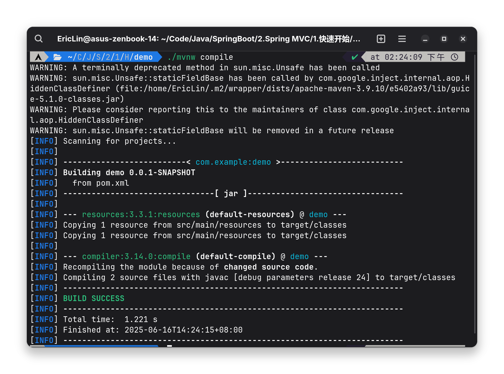

# Maven简介

## 什么是Maven？

Maven (Apache Maven) 是一款开源的自动化构建工具，可以帮助我们管理项目的构建、依赖管理、项目信息、报告生成等

## 传递依赖

传递依赖 (Transitive Dependencies) 是指当我们在项目中添加了一个依赖，而该依赖又依赖了其他的依赖，那么Maven会自动将这些依赖也添加到项目中，这就是传递依赖

## 在Spring Boot中使用Maven

`mvnw` 是 Spring Boot 提供的 Maven 打包脚本，它会自动执行 Maven 编译、测试、打包等步骤，并将最终的可执行 JAR 文件输出到 `target` 目录下

`mvnw` 提供以下层次的命令：

- `clean`：清理项目
    - `pre-clean`：清理之前的编译结果
    - `clean`：清理编译结果
    - `post-clean`：清理之后的编译结果



- `default`：编译、测试、打包项目
    - `compile`: 编译项目
    - `test`: 测试项目
    - `package`: 打包项目
    - `verify`：运行项目的单元测试
    - **注意：这个层次的执行顺序是 `compile` -> `test` -> `package` -> `verify`**



- `site`：生成项目报告

## 运行

使用以下命令运行 Spring Boot 项目：

```
./mvnw spring-boot:run
```