# 依赖注入

## 简介

在Spring Boot中，依赖注入 (Dependency Injection) 是指通过容器 (如Spring容器) 来管理应用组件之间依赖关系，并通过配置文件 (如properties文件或xml文件) 来配置这些依赖关系。通过使用依赖注入，我们可以很容易地替换掉原有组件，或者扩展应用的功能

## 图解

假设下面这个绿色的框框表示一个类


绿色里面的三个框框表示这个类的依赖类

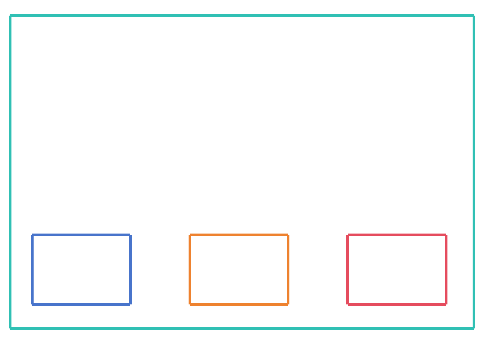

假设现在我们想更换这个类中的依赖类

通常，我们需要更改这个类里面的代码，但是这样做会导致代码的耦合性增大；效率低下，并且不利于维护

相反，我们可以**定义几个接口**

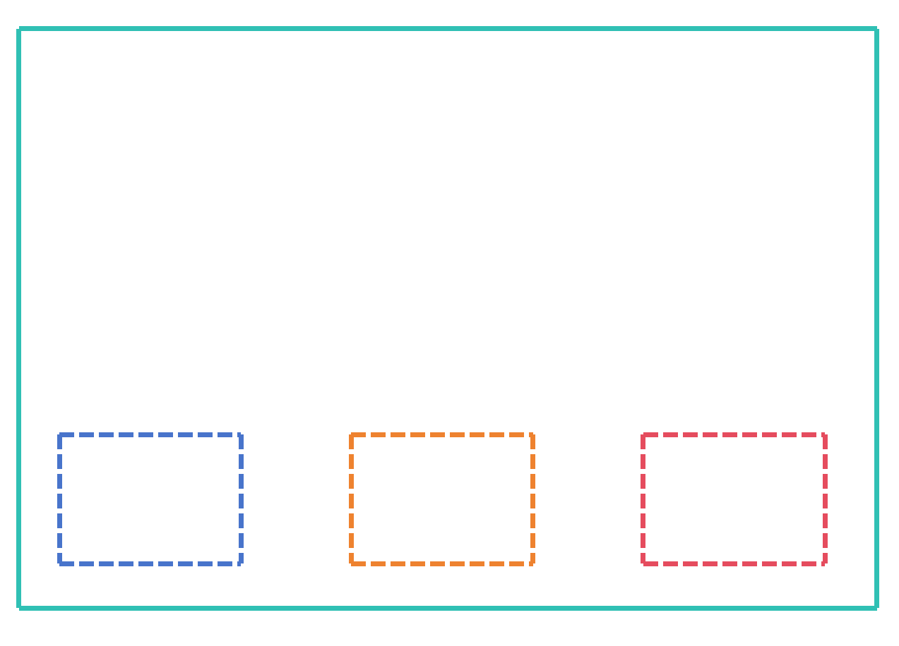

然后，在**外部实现这些接口，并通过配置文件注入到这个类中**

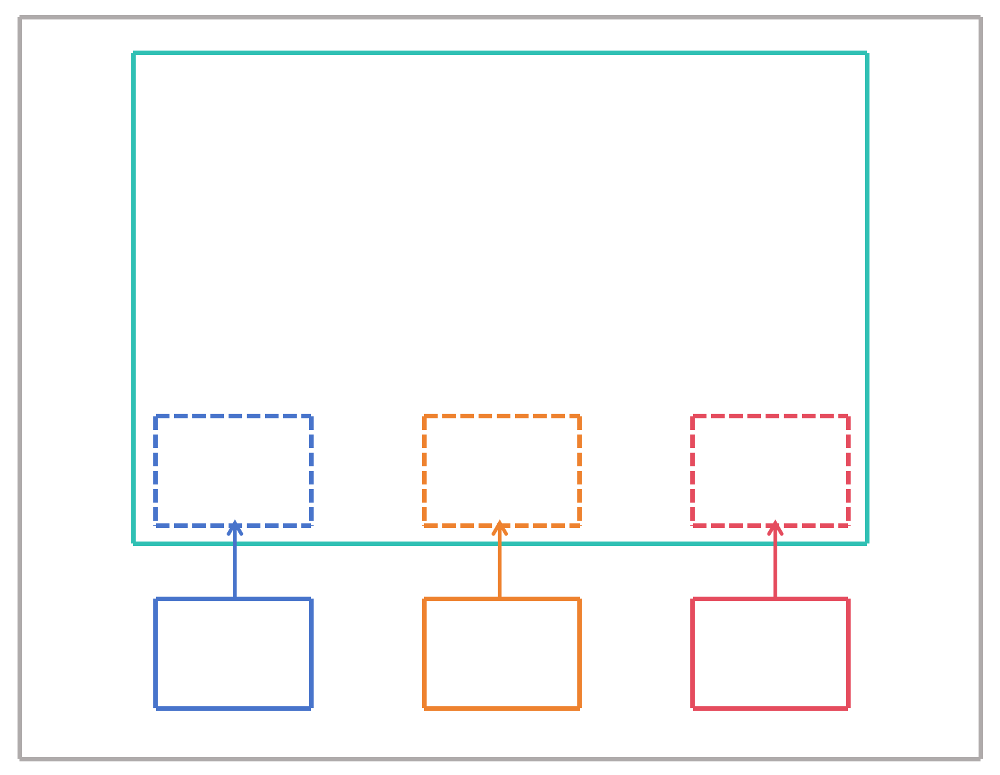

这样，当我们需要更换依赖类时，只需要实现相应的接口，并在配置文件中配置相应的实现类，就可以实现依赖注入

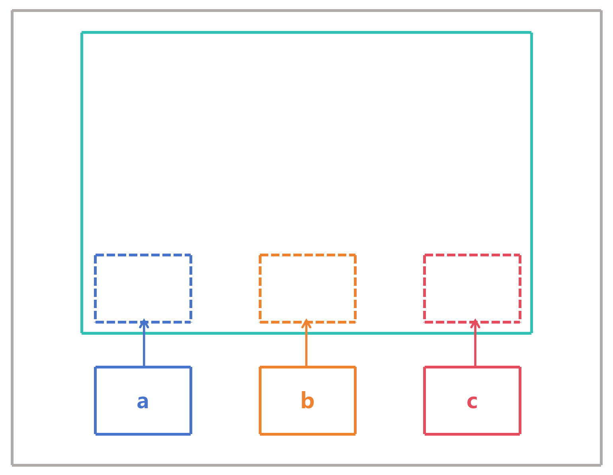
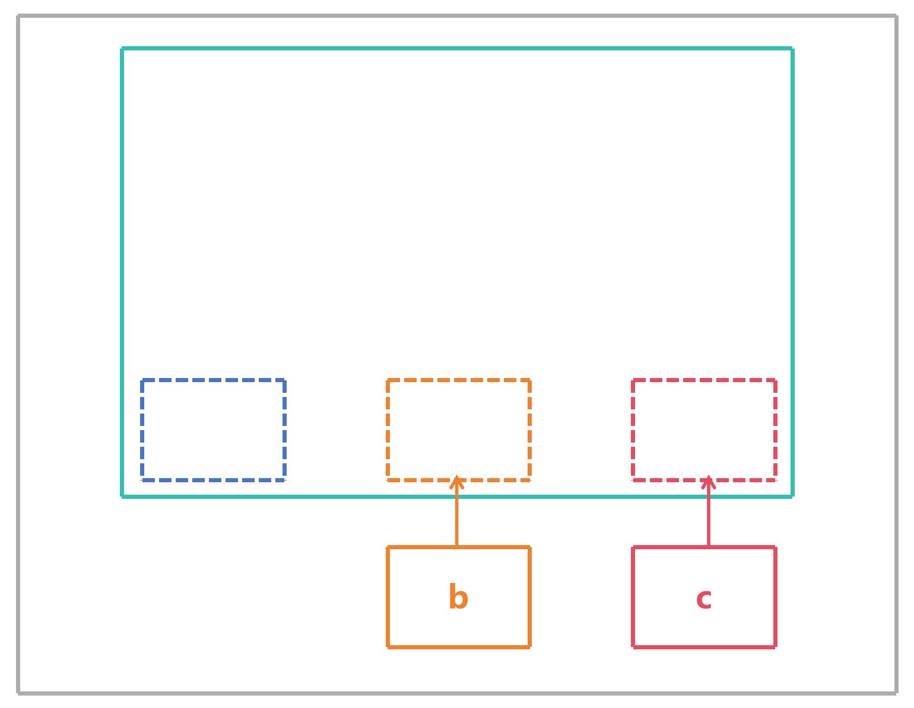
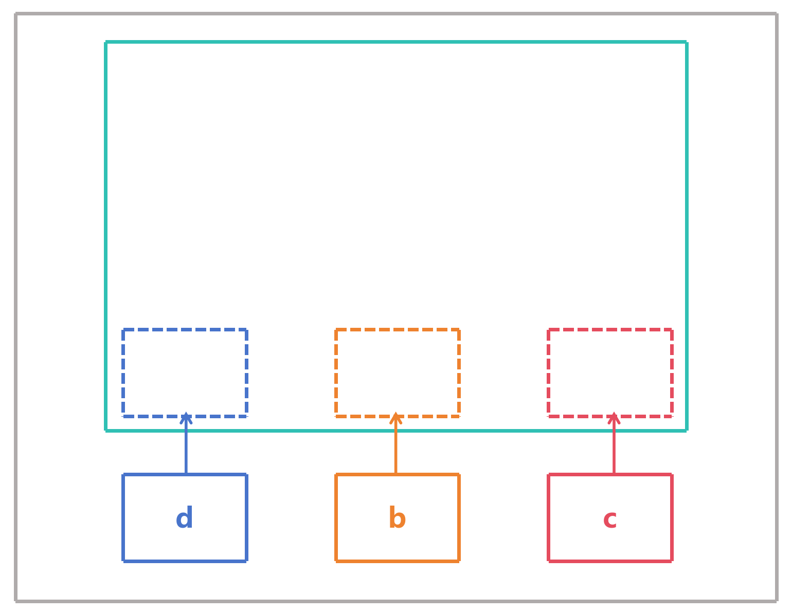

这样，我们就实现了依赖注入，使得代码的耦合性降低，并且可以方便地替换掉依赖类

## Beans

Beans 是 Spring 容器管理的对象，它是由 Spring 容器创建、配置和管理的对象。Beans 可以是任何类型的对象，包括BeanFactory、ApplicationContext、Service、Controller、Repository 等等

## 代码示例

### 创建接口

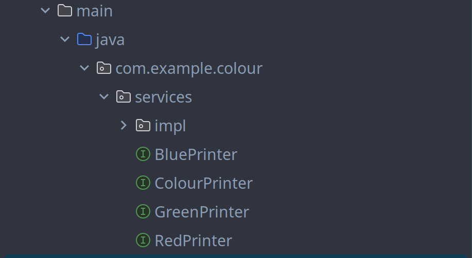

### 实现接口

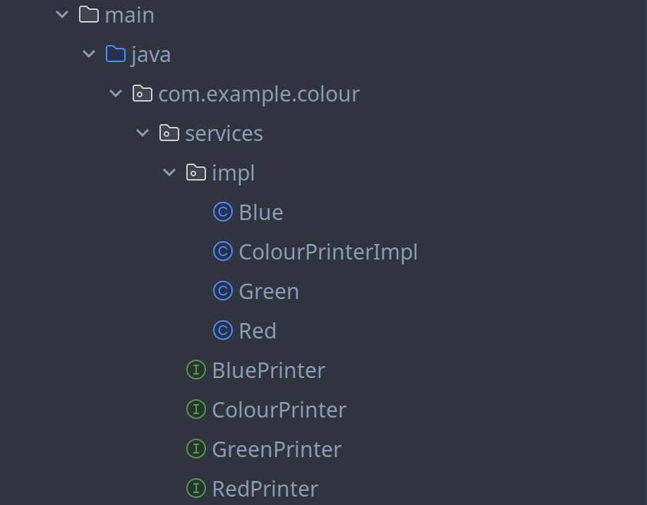

### 在控制台输出

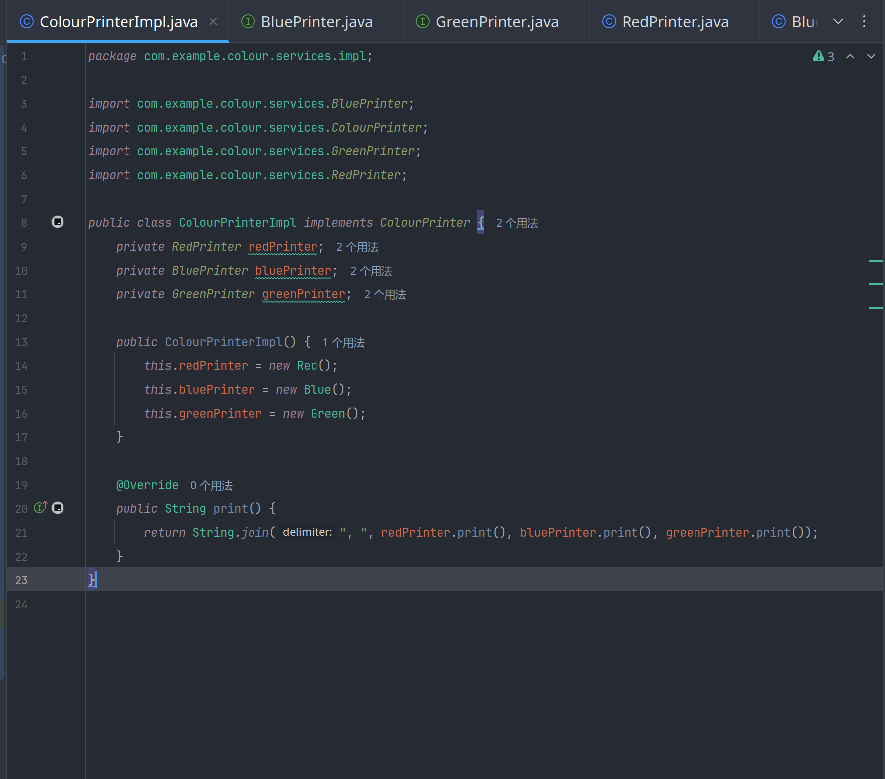
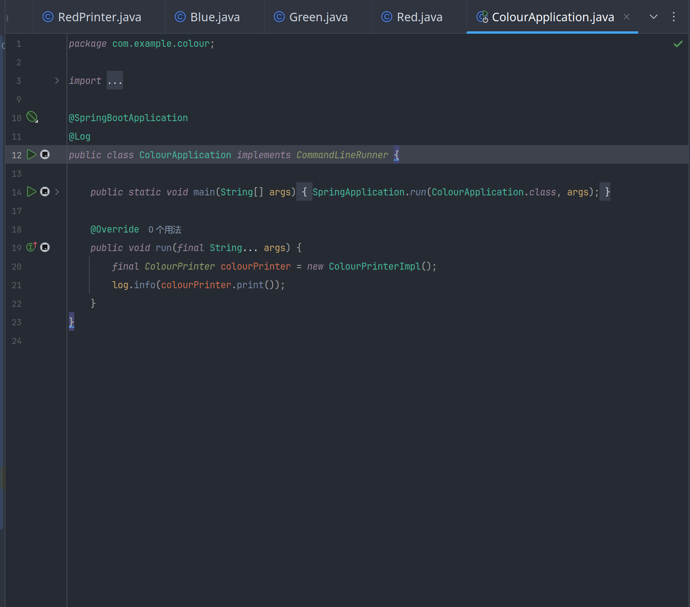

```
2025-06-16T16:28:14.737+08:00  INFO 33100 --- [colour] [           main] com.example.colour.ColourApplication     : red, blue, green
```

可以看到，我们可以看到控制台输出了红色、蓝色、绿色这三个颜色

现在，我们想用中文的方式输出颜色

### 设置配置类

配置类表示的是使用了 `@Configuration` 注解的类，它会告诉 Spring 容器，这个类里面的 Bean 可以被其他 Bean 依赖

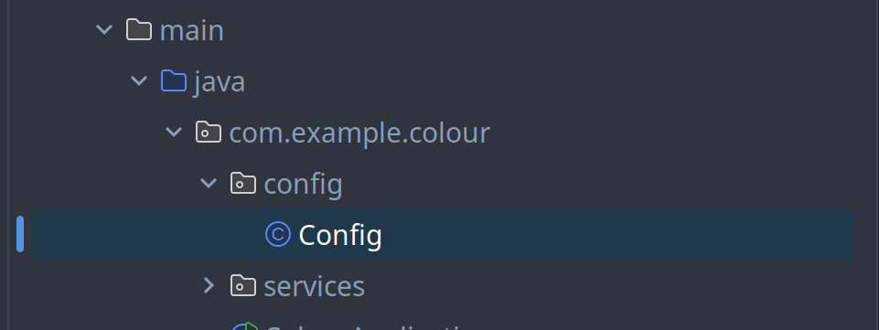

### 实现配置类

#### 添加 `@Configuration` 注解

```java
//Config.java

@Configuration
public class Config {
}
```

#### 添加 Bean

添加 Bean 到配置类中，Bean 就是我们想要注入的类

```java
//Config.java

@Configuration
public class Config {
    @Bean
    public BluePrinter bluePrinter() {
        return new Blue();
    }
    @Bean
    public GreenPrinter greenPrinter() {
        return new Green();
    }
    @Bean
    public String blue() {
        return bluePrinter().print();
    }
}
```

```java
// ColourPrinterImpl.java

public ColourPrinterImpl( RedPrinter redPrinter, BluePrinter bluePrinter, GreenPrinter greenPrinter ) {
    this.redPrinter = redPrinter;
    this.bluePrinter = bluePrinter;
    this.greenPrinter = greenPrinter;
}
```

#### 注入 Bean

这里需要在 `ColourApplication` 类中注入 Bean

```java
// ColourApplication.java

@SpringBootApplication
@Log
public class ColourApplication implements CommandLineRunner {
    private ColourPrinter colourPrinter;

    public ColourApplication(final ColourPrinter colourPrinter) { // 构造函数注入
        this.colourPrinter = colourPrinter;
    }

    public static void main(String[] args) {
        SpringApplication.run(ColourApplication.class, args);
    }

    @Override
    public void run(final String... args) {
        log.info(colourPrinter.print());
    }
}
```

```java
// Config.java

@Bean
public ColourPrinter colourPrinter(RedPrinter redPrinter, BluePrinter bluePrinter, GreenPrinter greenPrinter) {
    return new ColourPrinterImpl(redPrinter, bluePrinter, greenPrinter);
}
```

假设现在使用 `BlueCN` 类作为 `BluePrinter` 的实现类

```java
// BlueCN.java

public class BlueCN implements BluePrinter {
    @Override
    public String print() {
        return "蓝色";
    }
}
```

```java
// Config.java

@Bean
public BluePrinter bluePrinter() {
    return new BlueCN();
}
```

现在，我们可以看到控制台输出了中文的蓝色

```
2025-06-16T16:52:57.672+08:00  INFO 36490 --- [colour] [           main] com.example.colour.ColourApplication     : red, 蓝色, green
```

可以看到，我们成功地实现了依赖注入，并替换掉了原有依赖类，使得代码的耦合性降低，并且可以方便地扩展应用的功能