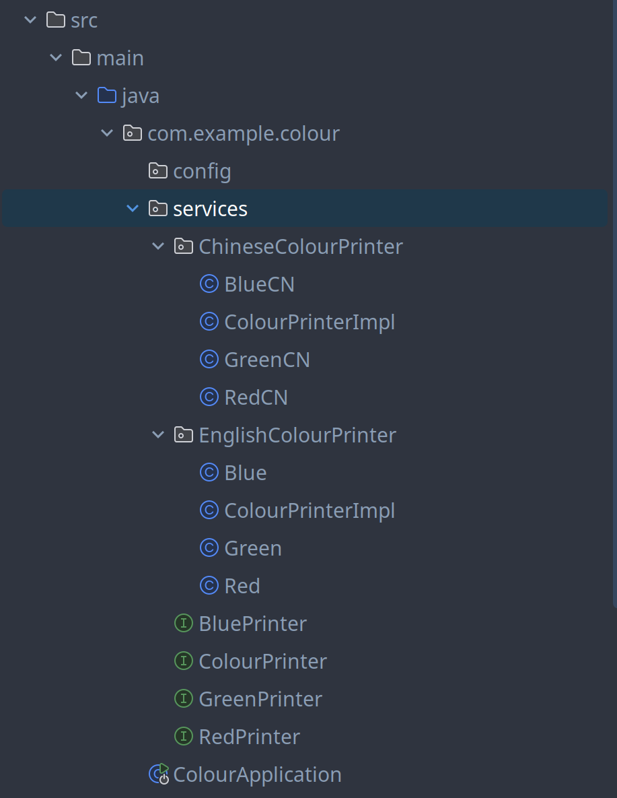

# @ComponentScan

## 简介

`@ComponentScan`注解用于扫描指定包及其子包下的所有类，并将其注册为Spring Bean

## 代码示例

假设现在我们将 `ColourPrinter` 拆分成英文和中文两个子包 `EnglishColourPrinter` 和 `ChineseColourPrinter`，目录结构如下：



此时直接运行 `ColourApplication` 会报错

```
ConfigServletWebServerApplicationContext : Exception encountered during context initialization - cancelling refresh attempt: org.springframework.beans.factory.BeanDefinitionStoreException: Failed to parse configuration class [com.example.colour.ColourApplication]
```

这是因为 Spring Boot 没有找到 `ColourPrinterImpl` 类，因为它并不在 `com.example.colour` 包下。而是被拆分并分别放在 ChinesesPrinter 和 EnglishPrinter 两个子包下

### 使用 `@ComponentScan` 注解

使用 `@ComponentScan` 注解可以指定扫描哪些包及其子包下的类，并将其注册为 Spring Bean

假设现在我们只需要扫描 `EnglishColourPrinter`

```java
// ColourApplication.java

@SpringBootApplication
@Log
@ComponentScan("com.example.colour.services.EnglishColourPrinter")
```

```
INFO 21898 --- [colour] [           main] com.example.colour.ColourApplication     : red, blue, green
```

可以看到 Spring 成功扫描到 `EnglishColourPrinter` 并将其注册为 Spring Bean，并成功打印出颜色

### 使用 `ChineseColourPrinter`

如果我们需要使用 `ChineseColourPrinter`，只需要在 `@ComponentScan` 注解中添加 `ChineseColourPrinter` 所在的包即可

```java
// ColourApplication.java

@SpringBootApplication
@Log
@ComponentScan("com.example.colour.services.ChineseColourPrinter")
```

```
INFO 21898 --- [colour] [           main] com.example.colour.ColourApplication     : 红色, 蓝色, 绿色
```

可以看到 Spring 成功扫描到 `ChineseColourPrinter` 并将其注册为 Spring Bean，并成功打印出颜色