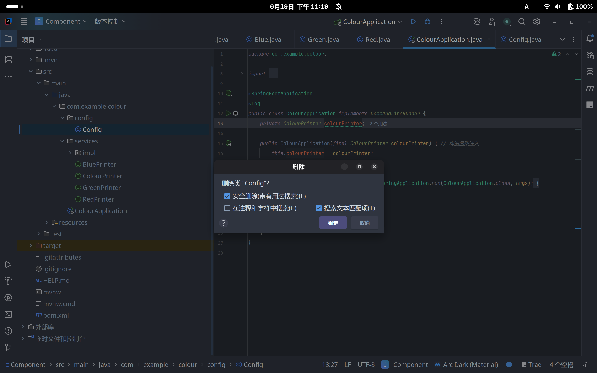
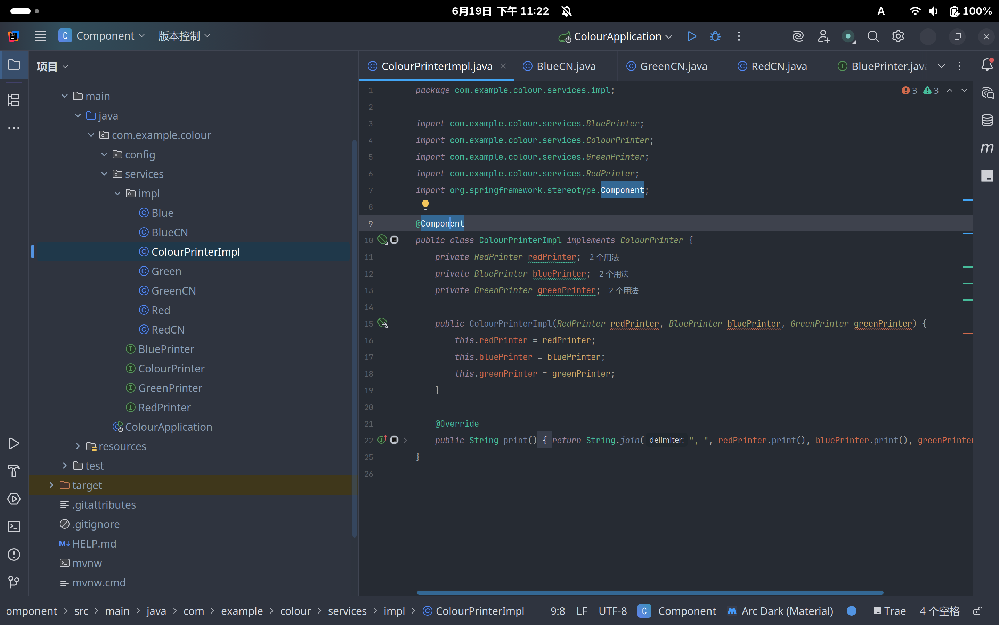
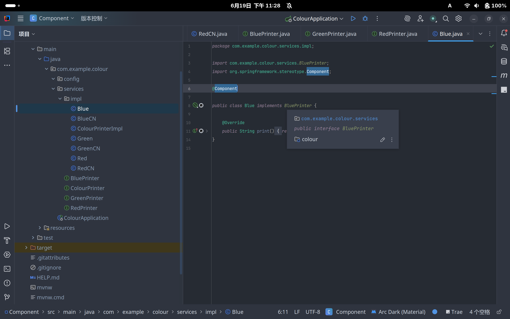
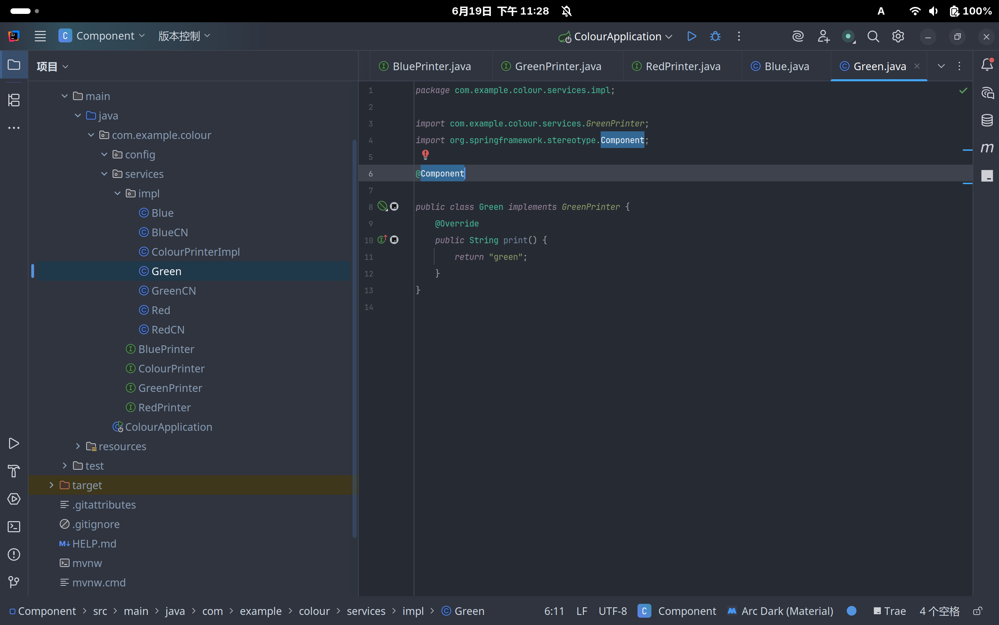
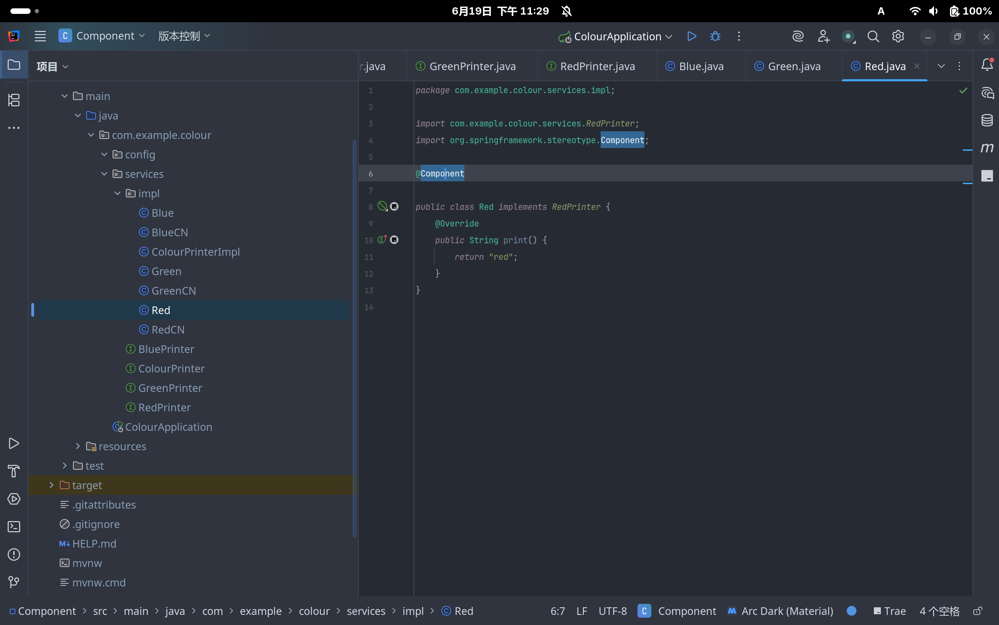
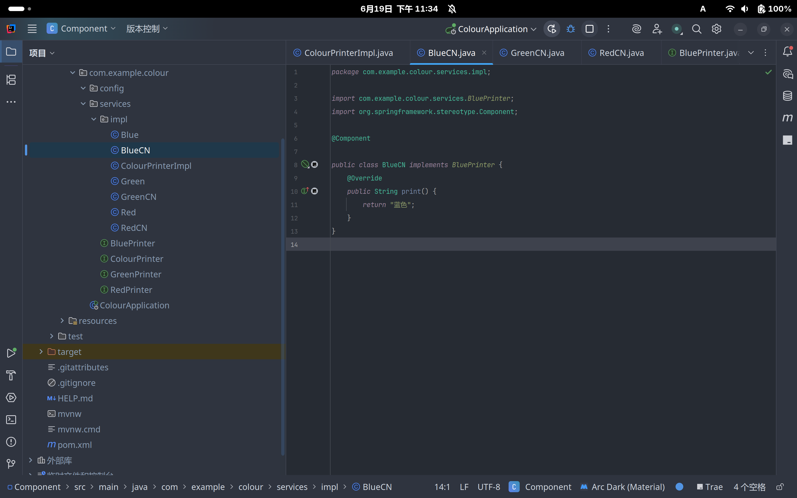

# @Component

## 简介

跟 `@Configuration` 类似，`@Component` 注解也可用于将类标记为 Spring Bean

## 代码示例

### 删除 `Config.java` 文件

由于使用 `@Component` 注解，所以之前使用 `@Configuration` 注解配置Bean的类不需要再使用 `@Configuration` 注解了



此时会报错

```
Parameter 0 of constructor in com.example.colour.ColourApplication required a bean of type 'com.example.colour.services.ColourPrinter' that could not be found.
```

这是因为 `com.example.colour.services.ColourPrinter` 是一个 Bean，但由于 `ColourApplication` 类没有使用 `@Component` 注解，所以 Spring 无法识别它

### 添加 `@Component` 注解

在 `src/main/java/com/example/colour/impl/ColourPrinterImpl.java` 文件上方添加 `@Component` 注解



这相当于告诉 Spring 这个类是一个 Bean，并将其注册到 Spring 容器中

同时这个类的**构造函数**相当于告诉 Spring **需要哪些依赖**才能实例化这个 Bean

所以也要在依赖类上 (此处为 `Red`、`Green`、`Blue` 类) 添加 `@Component` 注解





这样就可以正常运行了

```
2025-06-19T23:30:11.269+08:00  INFO 44827 --- [colour] [           main] com.example.colour.ColourApplication     : red, blue, green
```

### 切换依赖

如果需要切换依赖，只需要修改 `@Component` 注解的类名即可

假设现在要用中文输出 (此处为 `RedCN`、`GreenCN`、`BlueCN` 类)，只需要先移除英文依赖，再添加中文依赖



```
2025-06-19T23:33:48.570+08:00  INFO 46423 --- [colour] [           main] com.example.colour.ColourApplication     : 红色, 蓝色, 绿色
```

## 区别

| 适用范围 | `@Configuration` | `@Component` |
| :-------: | :--------------: | :-----------: |
| 类       | 配置类          | Bean         |
| 作用     | 用于配置 Spring Bean | 用于注册 Bean |
| 位置     | 类上            | 类上或方法上  |
| 依赖     | 无              | 有           |
