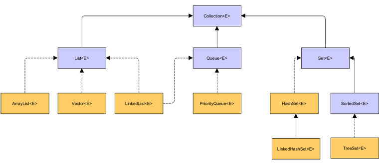

# 集合

## 定义

在Java中，集合是一个对象，可容纳其他对象的引用。集合接口声明了对每一种类型的集合可以执行的操作。通常情况下，集合接口有三种类型 —— List、Set 和 Queue

- List 是一个有序的集合，List中的每个元素都有一个索引。第一个元素的索引是0，而且允许有重复的元素

- Set 是一个不允许有重复元素的集合

- Queue 是一个有序的集合，在添加一个元素时，会按照一定的顺序将其插入队列中，而且允许有重复的元素

- **List、Set 和 Queue 都属于接口**，它们的实现类有 ArrayList、LinkedList、HashSet、TreeSet 等



## List

### ArrayList

ArrayList 是一个数组队列，相当于动态数组。与Java中的数组相比，它的容量能动态增长。它继承于AbstractList，实现了List, RandomAccess, Cloneable, java.io.Serializable这些接口

```java
public class ArrayList<E> extends AbstractList<E>
        implements List<E>, RandomAccess, Cloneable, java.io.Serializable
```

```java
ArrayList<Integer> list = new ArrayList<>();

list.add(1); // 添加元素
list.get(0); // 获取元素
list.remove(0); // 删除元素
list.size(); // 获取元素个数
list.clear(); // 清空元素
list.isEmpty(); // 判断是否为空
list.contains(1); // 判断是否包含元素
```

### LinkedList
LinkedList 是一个链表，它实现了List, Deque接口

```java
public class LinkedList<E>
    extends AbstractSequentialList<E>
    implements List<E>, Deque<E>, Cloneable, java.io.Serializable
```

```java
LinkedList<Integer> list = new LinkedList<>();

list.add(1); // 添加元素
list.get(0); // 获取元素
list.remove(0); // 删除元素
list.size(); // 获取元素个数
list.clear(); // 清空元素
list.isEmpty(); // 判断是否为空
list.contains(1); // 判断是否包含元素
```

由于LinkedList实现了Deque (双端队列) 接口，**所以LinkedList也可以作为队列，栈或者双端队列使用**

```java
LinkedList<Integer> list = new LinkedList<>();

list.addFirst(1); // 添加元素到队列头部
list.addLast(2); // 添加元素到队列尾部
list.removeFirst(); // 删除队列头部元素
list.removeLast(); // 删除队列尾部元素
list.getFirst(); // 获取队列头部元素
list.getLast(); // 获取队列尾部元素
list.offer(1); // 添加元素到队列尾部
list.poll(); // 删除队列头部元素
list.peek(); // 获取队列头部元素
list.push(1); // 添加元素到栈顶
list.pop(); // 删除栈顶元素
list.element(); // 获取栈顶元素
```

- 相比 `add()`、`remove()`、`get()` 等方法，`offer()`、`poll()`、`peek()` 等方法更好用，因为它们**不会抛出异常**

## Queue

### PriorityQueue

PriorityQueue 是一个优先级队列，它的元素按照自然顺序或者自定义顺序排序

```java
PriorityQueue<Integer> queue = new PriorityQueue<>();

queue.add(1); // 添加元素
queue.poll(); // 删除元素
queue.peek(); // 获取元素
queue.size(); // 获取元素个数
queue.clear(); // 清空元素
queue.isEmpty(); // 判断是否为空
queue.contains(1); // 判断是否包含元素
```

## Map

### HashMap

HashMap 是一个基于Hash算法实现的集合

```java
HashMap<Integer, Integer> map = new HashMap<>();

map.put(1, 1); // 添加元素
map.get(1); // 获取元素
map.remove(1); // 删除元素
map.size(); // 获取元素个数
map.clear(); // 清空元素
map.isEmpty(); // 判断是否为空
map.contains(1); // 判断是否包含元素
```

### LinkedHashMap

LinkedHashMap 是一个基于Hash算法实现的集合，它**保持元素的插入顺序**

```java
LinkedHashMap<Integer, Integer> map = new LinkedHashMap<>();

map.put(1, 1); // 添加元素
map.get(1); // 获取元素
map.remove(1); // 删除元素
map.size(); // 获取元素个数
map.clear(); // 清空元素
map.isEmpty(); // 判断是否为空
map.contains(1); // 判断是否包含元素
```

## Set

### HashSet

HashSet 是一个基于Hash算法实现的集合，它**不允许有重复元素**

```java
HashSet<Integer> set = new HashSet<>();
set.add(1); // 添加元素
set.remove(1); // 删除元素
set.size(); // 获取元素个数
set.clear(); // 清空元素
set.isEmpty(); // 判断是否为空
set.contains(1); // 判断是否包含元素
```

### TreeSet
TreeSet 是一个基于Tree算法实现的集合，它**不允许有重复元素**

```java
TreeSet<Integer> set = new TreeSet<>();

set.add(1); // 添加元素
set.remove(1); // 删除元素
set.size(); // 获取元素个数
set.clear(); // 清空元素
set.isEmpty(); // 判断是否为空
set.contains(1); // 判断是否包含元素
```

## Collections

Collections 是一个工具类，它包含了很多静态方法，用于对集合进行排序、搜索和线程安全等操作

```java
ArraysList<Integer> list = new ArrayList<>();

Collections.sort(list); // 排序
Collections.reverse(list); // 反转
Collections.shuffle(list); // 随机排序
Collections.binarySearch(list, 1); // 二分查找
Collections.max(list); // 获取最大值
Collections.min(list); // 获取最小值
Collections.frequency(list, 1); // 获取元素出现次数
Collections.addAll(list, 1, 2, 3); // 添加全部元素
```

### synchronizedList

synchronizedList 是一个线程安全的集合，它**可以将一个集合包装成一个线程安全的集合**

```java
List<Integer> list = Collections.synchronizedList(new ArrayList<>());
```